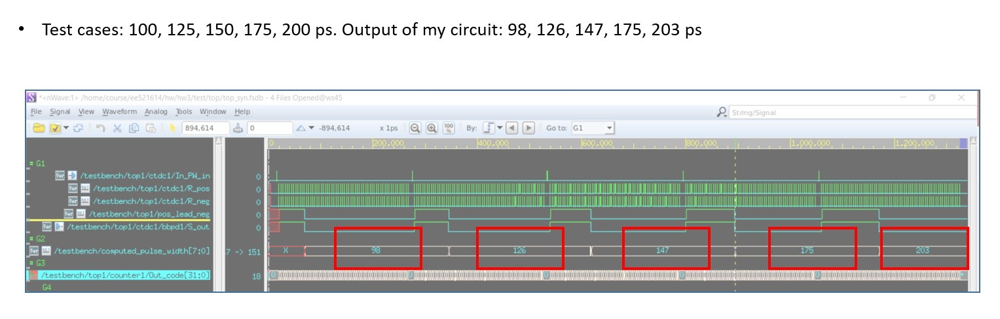
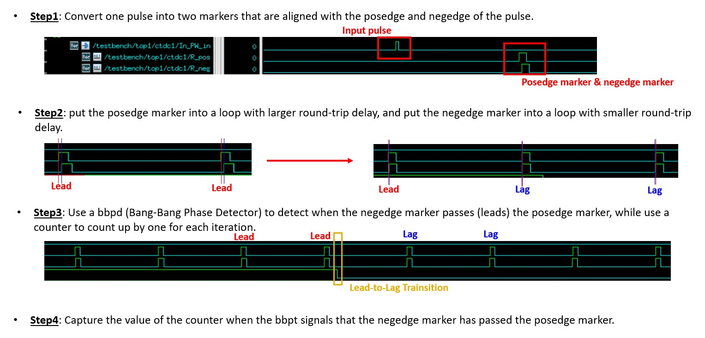

## Results

<p align="center">
  
</p>

## Ideal: Vernier cylic TDC

<p align="center">
  
</p>

## Run simulation


```bash
$ dc_shell -f syn.tcl
$ vcs tb.v ./top_syn.v -v /home/m110/m110061576/process/CBDK_TSMC90GUTM_Arm_f1.0/orig_lib/aci/sc-x/verilog/tsmc090.v -full64 -R -debug_access+all +v2k +neg_tchk
```
